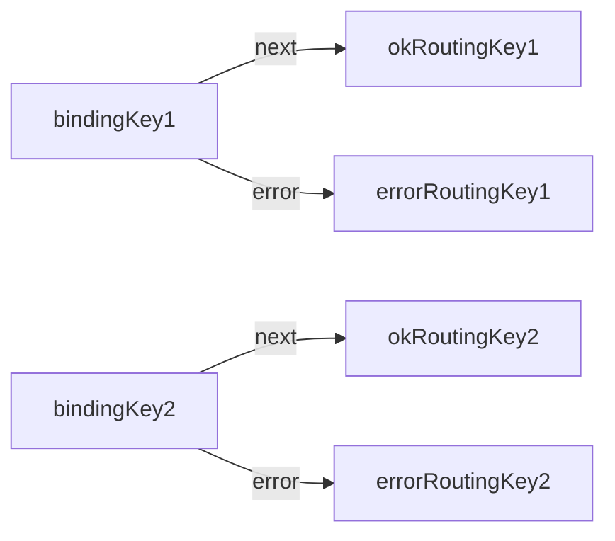

# Projeto de Gerenciamento de Configurações com ETCD e Geração de Diagramas

## Descrição

Este projeto é uma ferramenta CLI (Command Line Interface) que interage com o ETCD para leitura de configurações, salvando-as em arquivos JSON. Além disso, ele lê esses arquivos JSON, filtra informações específicas e gera diagramas de fluxo usando Mermaid.js. Esta ferramenta é útil para gerenciar e visualizar configurações complexas em ambientes de micro-serviços.

## Funcionalidades

1. **Leitura de Configurações do ETCD**: Conecta-se ao ETCD, lê todas as chaves e valores, e filtra aqueles que não contêm '/env-'.
2. **Salvamento em Arquivos JSON**: Salva as configurações filtradas em arquivos JSON no diretório `./json`.
3. **Leitura e Filtragem de Arquivos JSON**: Lê os arquivos JSON, filtra informações específicas baseadas na chave `Exchange`.
4. **Geração de Diagramas de Fluxo**: Gera diagramas de fluxo usando Mermaid.js e os salva em formatos SVG e PNG.

## Estrutura do Projeto

- `app.js`: Contém a classe principal `Main` para leitura do ETCD e salvamento em JSON.
- `JsonFileReader.js`: Classe para leitura dos arquivos JSON.
- `ExchangeFinder.js`: Classe para filtragem das configurações baseadas na chave `Exchange`.
- `MermaidFlowchartGenerator.js`: Classe para geração de diagramas de fluxo.
- `flow-cli.js`: Script CLI para execução das funcionalidades.
- `./json`: Diretório onde os arquivos JSON são salvos.
- `./output`: Diretório onde as saídas dos finder e diagrams são salvas.

## Como Executar

### Pré-requisitos

- Node.js instalado
- ETCD em execução
- Mermaid CLI instalado globalmente:
  ```bash
  npm install -g @mermaid-js/mermaid-cli
  ```
- Pacotes necessários:
  ```bash
  npm install etcd3 commander
  ```
## Uso

### Inicialização

Primeiro, clone o repositório e instale as dependências:

```bash
git clone <repo-url>
cd <repo-directory>
npm install
```

### Leitura do ETCD e Salvamento em JSON

Para ler as configurações do ETCD e salvá-las em arquivos JSON, execute:

```bash
node flow-cli.js -g
```

### Filtragem e Geração de Arquivos

Para filtrar os arquivos JSON e salvar as informações específicas, use as flags -e e -o:

```bash
node flow-cli.js -e <exchange-name> -o <output-name>
```

### Geração de Diagramas de Fluxo

Para gerar diagramas de fluxo a partir dos arquivos JSON, execute:

```bash
node flow-cli.js -e <exchange-name> -o <nome-do-arquivo> -p <nome-do-arquivo> -s <nome-do-arquivo>
```

### Exemplos de Comando
Apenas leitura do ETCD e salvamento em JSON:

```bash
  node flow-cli.js -g
```

### Filtragem e salvamento com geração de PNG e SVG:

```bash
  node flow-cli.js -e moirai.topic.vpn.delete -o resultado -s diagrama -p diagrama
```

### Saídas
- JSON Filtrado: Os resultados filtrados são salvos no arquivo especificado com a extensão .json.

- Diagrama SVG: Se especificado, o diagrama será salvo com a extensão .svg.

- Diagrama PNG: Se especificado, o diagrama será salvo com a extensão .png.

### Exemplo de Flowchart
Aqui está um exemplo de como seria um diagrama de fluxo gerado pelo script:


## Considerações Finais

Este projeto fornece uma maneira eficaz de gerenciar e visualizar configurações em um ambiente de micro-serviços. A modularidade do código permite fácil manutenção e extensibilidade, sendo uma ferramenta poderosa para desenvolvedores e administradores de sistemas.